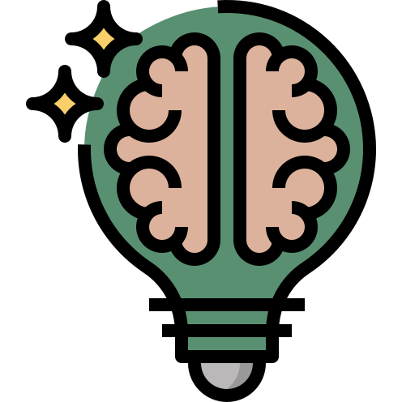
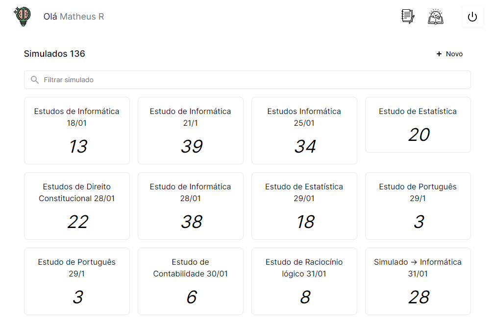
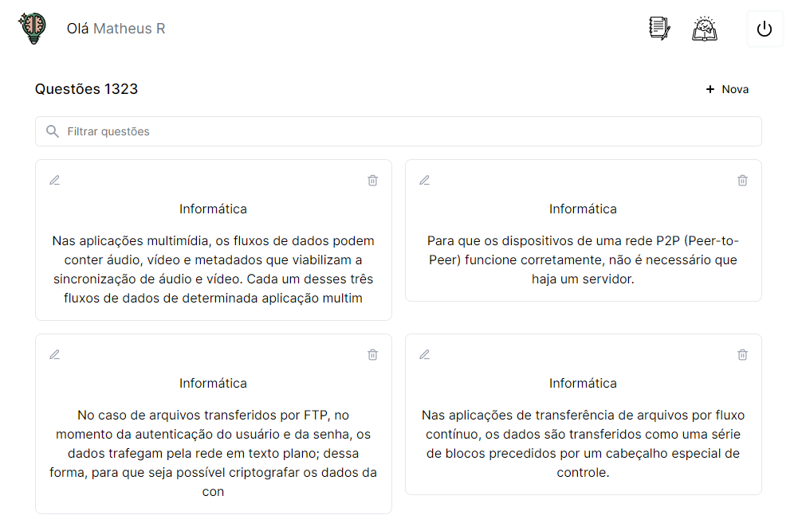
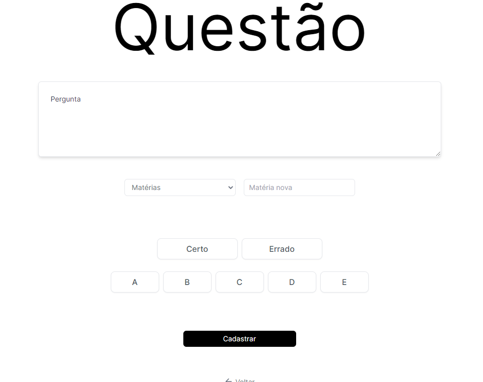
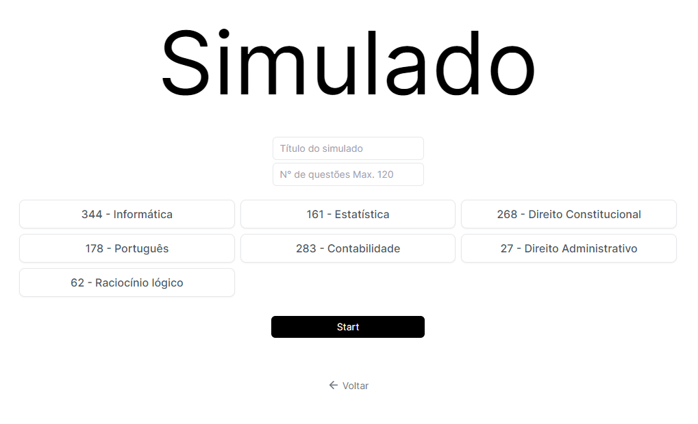
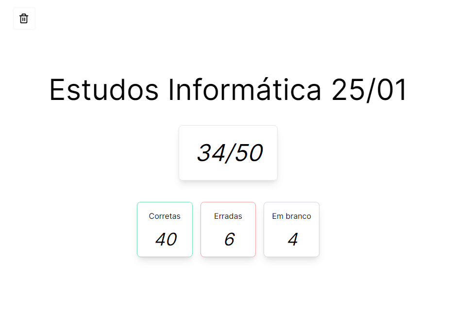
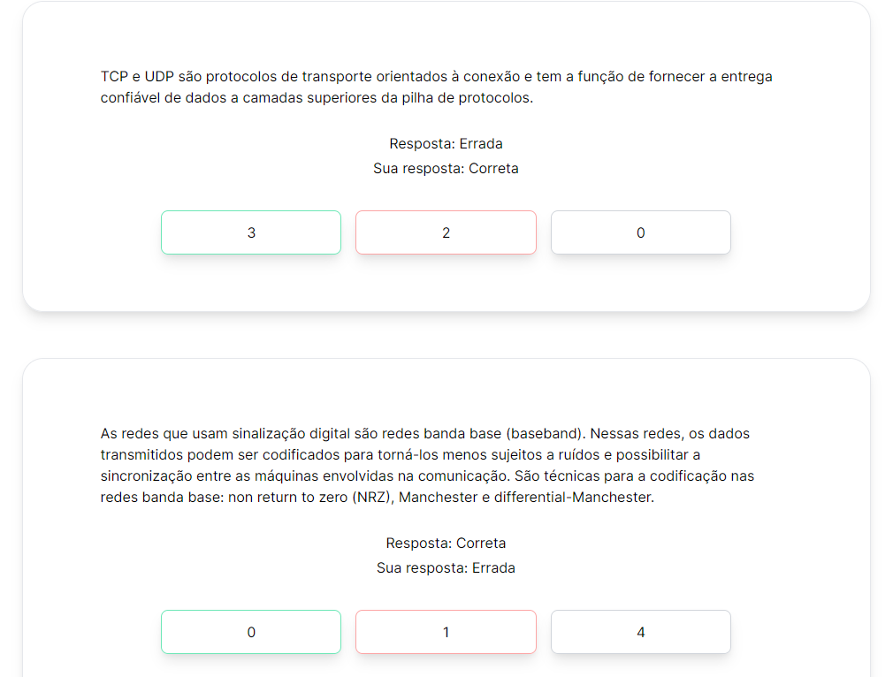

<div align="center">
    
    <h1>Simulados</h1>
</div>

Um projeto que criei para fazer simulados com base na banca Cebraspe( uma questão errada anula uma certa )

> :computer: Aplicação na [Vercel](https://simulados.vercel.app/)

# Tecnologias
- [X] [Next](https://nextjs.org/)
- [X] [MongoDB](https://www.mongodb.com/)
- [X] [Tailwindcss](https://tailwindcss.com/)

## Instale as dependencias
```
#npm
npm install

#yarn
yarn
```


###.next.config.js
```
module.exports = {
    env: {
        MONGO_URL: 'link mongo',
    },
  }
```
---
## :camera: Imagens da aplicação

### Home


### Questões



### Simulados



